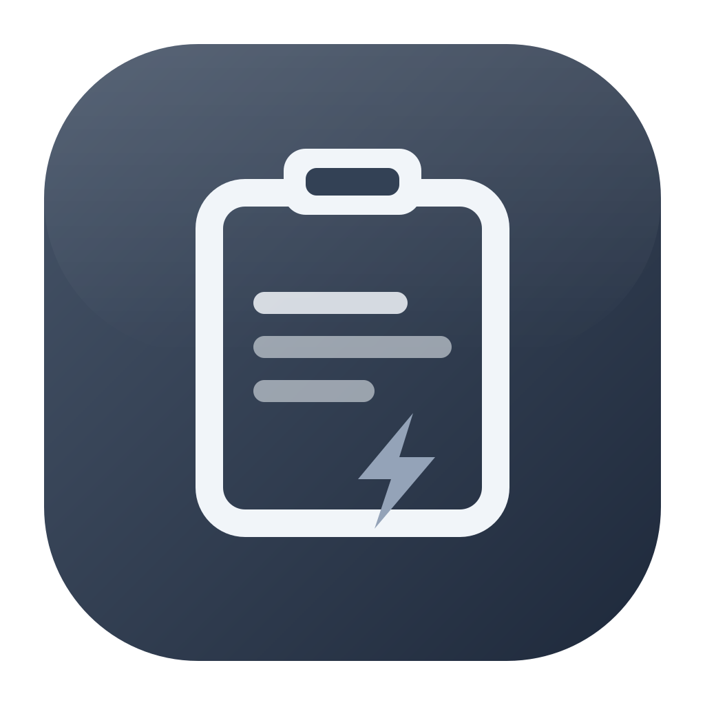
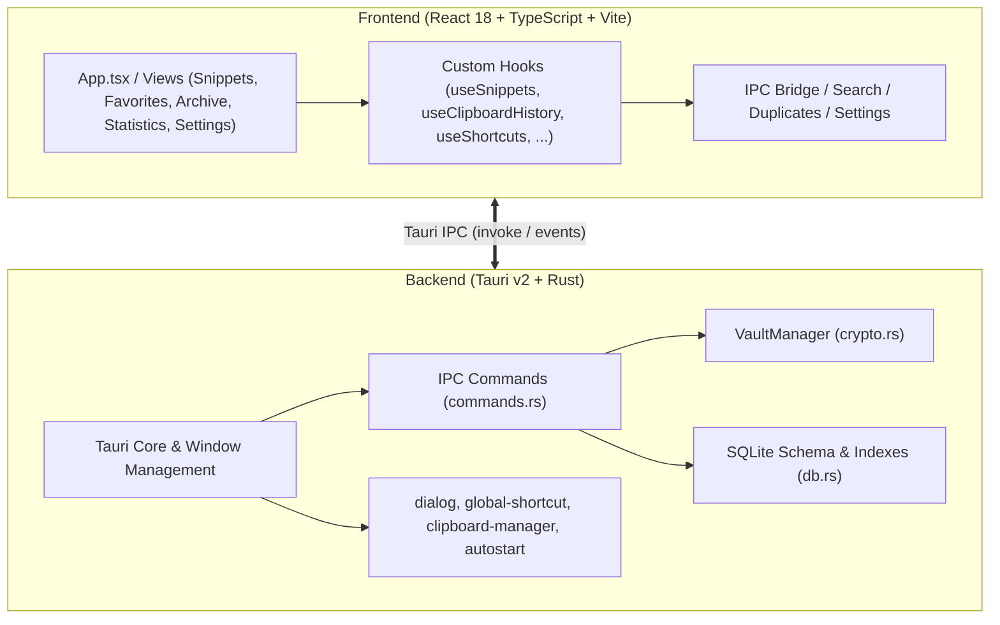

# ClipVault

<p align="center">
  <strong>A fast, privacy-first clipboard history & snippet manager for Windows — 100% local, no cloud.</strong>
</p>

<p align="center">
  
</p>

<p align="center">
  
  
  
  
  
  
  
</p>

---

## Overview

**ClipVault** is designed for one job: capturing, organizing, and retrieving everything you copy — instantly and privately.

Instead of losing copied text to the void of the system clipboard or trusting third-party cloud services with your snippets and credentials, ClipVault automatically records your clipboard history, lets you save and tag reusable snippets, and puts everything one keystroke away. All data lives in an embedded local **SQLite** database with zero telemetry, zero network calls, and optional **AES-256-GCM encryption** for sensitive entries.

---

## Key Features

- ⚡ **Instant Capture, Zero Bloat**: Powered by **Tauri v2** and **Rust** for minimal resource consumption and a fast, keyboard-driven workflow.
- 📋 **Clipboard History** *(optional)*: Automatically captures text you copy system-wide with a configurable retention limit (25–500 entries, default 100). When the limit is exceeded, the oldest auto-captured entries are removed first — manually created snippets, favorites, and pinned snippets are never removed automatically.
- ✍️ **Snippets with Types & Tags**: Rapidly capture snippets categorized by type (`code`, `text`, `link`) and organize them with custom tags.
- 📌 **Pin, Favorite & Archive**: Keep critical snippets pinned to the top, favorite frequently used items, and archive obsolete items safely.
- 🔍 **Real-Time Search & Filtering**: Instant search across titles, content, and tags with filters for type, tags, and date sorting.
- 🔐 **Encrypted Vault**: Mark snippets as *sensitive* to hide their content in the UI and encrypt them at rest with **AES-256-GCM**, with keys derived via **Argon2id**. Lock and unlock the vault with a passphrase, change it, or disable encryption at any time. Sensitive content is excluded from clipboard duplicate matching and never appears in plaintext while locked.
- 🛡️ **Duplicate Prevention**: Whitespace-normalized duplicate detection prevents redundant entries without accidental overwrites.
- 📦 **Bulk Operations**: Select multiple items to bulk archive, favorite, or delete.
- 🌍 **Global Quick Capture Shortcut** *(optional)*: A system-wide shortcut (default suggestion `Ctrl+Alt+V`, disabled by default) that opens/focuses ClipVault's Quick Capture from any application. Conflicts with other apps are reported instead of failing silently.
- 🚀 **Auto Start with Windows** *(optional)*: Optionally launch ClipVault on Windows startup minimized in the background with zero idle CPU overhead.
- 📊 **100% Local Usage Statistics**: Aggregate metrics including total, active, favorite, archived, and sensitive counts, type and source breakdowns, and a ranked leaderboard of your most frequently copied snippets — all calculated locally via SQLite.
- 🌓 **Dark, Light & System Themes**: Persistent theme preference with automatic OS theme detection.
- 🖱️ **Native Desktop Context Menu**: Right-click any snippet for instant access to copy, edit, favorite, pin, sensitive toggle, archive, and delete with keyboard shortcut hints.
- 💾 **Import & Export**: Versioned JSON backup and restore with built-in schema validation and duplicate skipping.
- 🔒 **100% Local & Private**: All data is persisted in an embedded SQLite database (`rusqlite`) in your OS app data folder. Zero telemetry, zero cloud lock-in.

---

## Keyboard Shortcuts & Gestures

| Shortcut / Action | Description |
| :--- | :--- |
| <kbd>Ctrl</kbd> + <kbd>K</kbd> (<kbd>Cmd</kbd> + <kbd>K</kbd>) | Focus the search bar |
| <kbd>Ctrl</kbd> + <kbd>I</kbd> (<kbd>Cmd</kbd> + <kbd>I</kbd>) | Focus Quick Capture |
| <kbd>Ctrl</kbd> + <kbd>N</kbd> (<kbd>Cmd</kbd> + <kbd>N</kbd>) | Open the New Snippet form |
| <kbd>Ctrl</kbd> + <kbd>,</kbd> (<kbd>Cmd</kbd> + <kbd>,</kbd>) | Jump to Settings |
| <kbd>?</kbd> or <kbd>F1</kbd> | Floating keyboard shortcuts cheat sheet |
| <kbd>↑</kbd> / <kbd>↓</kbd> | Navigate snippets with smooth auto-scrolling |
| <kbd>Enter</kbd> | Open the selected snippet in the full editor |
| <kbd>Ctrl</kbd> + <kbd>C</kbd> (<kbd>Cmd</kbd> + <kbd>C</kbd>) | Copy the selected snippet to the clipboard |
| <kbd>Ctrl</kbd> + <kbd>D</kbd> (<kbd>Cmd</kbd> + <kbd>D</kbd>) or <kbd>F</kbd> | Toggle favorite |
| <kbd>P</kbd> | Pin / unpin to top |
| <kbd>Del</kbd> or <kbd>Backspace</kbd> | Archive snippet (or permanently delete in Archive view) |
| <kbd>Esc</kbd> | Clear search / blur input, close editor, dismiss modals & context menus |
| **Right-Click** | Context menu to copy, edit, favorite, pin, toggle sensitivity, archive, or delete |

---

## Architecture & Tech Stack



- **Frontend**: [React 18](https://react.dev/), [TypeScript](https://www.typescriptlang.org/), [Vite](https://vite.dev/), Vanilla CSS
- **Backend Desktop Runtime**: [Tauri v2](https://v2.tauri.app/), [Rust](https://www.rust-lang.org/)
- **Storage & Security**: [SQLite](https://www.sqlite.org/) via [`rusqlite`](https://crates.io/crates/rusqlite) (bundled), [`aes-gcm`](https://crates.io/crates/aes-gcm), [`argon2`](https://crates.io/crates/argon2), [`zeroize`](https://crates.io/crates/zeroize)
- **Native OS Plugins**: `tauri-plugin-dialog`, `tauri-plugin-global-shortcut`, `tauri-plugin-clipboard-manager`, `tauri-plugin-autostart`

---

## Project Structure

```text
ClipVault/
├── public/                     # Static assets (app icon, favicons)
├── src/                        # Frontend React application
│   ├── components/             # UI components
│   │   ├── BulkActionBar.tsx   # Multi-select bulk actions toolbar
│   │   ├── ClipboardHistorySettings.tsx # Clipboard retention configuration
│   │   ├── ContextMenu.tsx     # Native right-click context menu
│   │   ├── EmptyState.tsx      # Empty / no-results placeholder
│   │   ├── FilterBar.tsx       # Type, tag & date filters
│   │   ├── Icons.tsx           # Crisp SVG icon set
│   │   ├── NewSnippetForm.tsx  # Snippet creation form
│   │   ├── QuickCapture.tsx    # Rapid inline capture input
│   │   ├── SearchBar.tsx       # Real-time search input
│   │   ├── ShortcutSettings.tsx# Global hotkey recorder
│   │   ├── ShortcutsHelpModal.tsx # Floating keyboard cheat sheet
│   │   ├── Sidebar.tsx         # Primary navigation & vault status
│   │   ├── SnippetCard.tsx     # Individual snippet display card
│   │   ├── SnippetEditor.tsx   # Full snippet editor
│   │   ├── VaultModal.tsx      # Vault lock / unlock passphrase dialog
│   │   └── VaultSettings.tsx   # Encryption setup & passphrase management
│   ├── hooks/                  # Custom React hooks (useSnippets, useClipboardHistory, useShortcuts, useVault, useTheme, ...)
│   ├── lib/                    # Utilities (api IPC bridge, search, shortcuts, settings, duplicates, time)
│   ├── views/                  # Views (SnippetsView, FavoritesView, ArchiveView, StatisticsView, SettingsView)
│   ├── App.tsx                 # Root application layout & coordinator
│   ├── main.tsx                # React application entry point
│   ├── styles.css              # Custom styling & dark/light themes
│   └── types.ts                # Core TypeScript interfaces & ViewId definitions
├── src-tauri/                  # Rust desktop backend
│   ├── src/
│   │   ├── commands.rs         # Tauri IPC commands: CRUD, import/export, clipboard capture, statistics
│   │   ├── crypto.rs           # VaultManager: Argon2id key derivation & AES-256-GCM encryption
│   │   ├── db.rs               # SQLite schema, migrations & performance indexes
│   │   └── main.rs             # Tauri application entry point & plugin registrations
│   ├── Cargo.toml              # Rust dependencies & configuration
│   └── tauri.conf.json         # Tauri app, window & bundle settings
├── index.html                  # HTML shell
├── package.json                # Node.js scripts & frontend dependencies
├── LICENSE                     # PolyForm Noncommercial License 1.0.0
├── tsconfig.json               # TypeScript configuration
└── vite.config.ts              # Vite build configuration
```

---

## Getting Started

### Prerequisites

Ensure you have the following installed on your Windows machine:

1. **[Node.js](https://nodejs.org/)** (v18 or higher)
2. **[Rust & Cargo](https://rustup.rs/)** (v1.75 or higher)
3. **C++ Build Tools** (via [Visual Studio Build Tools](https://visualstudio.microsoft.com/visual-cpp-build-tools/) or Visual Studio with "Desktop development with C++" workload)

### Installation & Development

1. **Clone the repository**:
   ```bash
   git clone https://github.com/your-username/clipvault.git
   cd clipvault
   ```

2. **Install dependencies**:
   ```bash
   npm install
   ```

3. **Launch in development mode**:
   ```bash
   npm run tauri dev
   ```

### Production Build

To generate an optimized release binary and Windows installer (NSIS / MSI):

```bash
npm run tauri build
```

The compiled binary (`clipvault.exe`) and installers will be output to:
```text
src-tauri/target/release/bundle/
```

---

## Testing & Quality

### Rust Backend Tests
Run the unit test suite verifying snippet CRUD, clipboard pruning, encryption/locking, and statistics:

```bash
cargo test --manifest-path src-tauri/Cargo.toml
```

### Frontend Type Check & Build
Verify TypeScript types and Vite bundle integrity:

```bash
npm run build
```

---

## License

This project is licensed under the [PolyForm Noncommercial License 1.0.0](LICENSE).

> Required Notice: Emirhan Akdeniz, github.com/emirhanakdeniz

In short, this license permits any **noncommercial** use of ClipVault — including personal use, hobby projects, and use by charitable, educational, research, public safety/health, environmental, and governmental organizations — as well as changes and redistribution of the software for noncommercial purposes, provided that the license terms and the Required Notice above are passed along. Commercial use is not permitted under these terms; contact the licensor if you need a commercial license.

